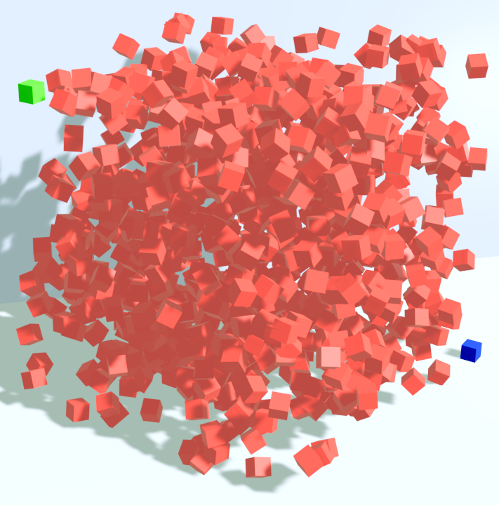
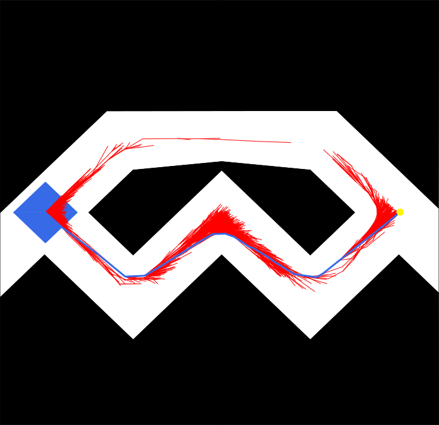
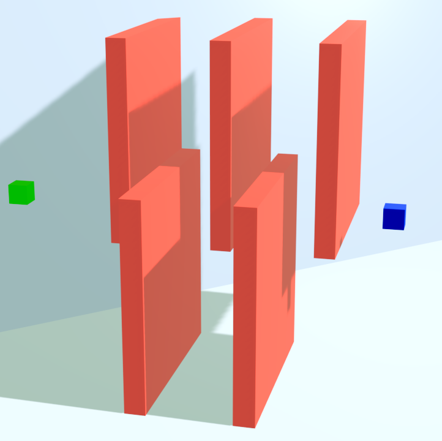

# Julia Planning Library

A Julia based library made for comparing motion planning algorithms.

## Dependencies

* Julia
* Clang
  
Julia packages (will be downloaded by the installation script):
```
LinearAlgebra
Statistics
ReferenceFrameRotations
DelimitedFiles
Libdl
Random
PyCall           # optional
SpecialFunctions # optional
PlotlyJS         # optional
```
## Installation

First, pull this repository to `/JPL`.

This library is written in Julia and uses some C++ libraries. You will need to install Julia and one C++ library ([RAPID](http://gamma.cs.unc.edu/OBB/)).

You can get Julia from [Julia download page](https://julialang.org/downloads/).

For collision detection and nearest neighbor search, these C++ libraries are used:

* collision detection: [RAPID](http://gamma.cs.unc.edu/OBB/)
* nearest neighbor search: [mpnn2](https://lavalle.pl/papers/YerLav06.pdf) (included)
* k-nearest neighbor search: [nanoflann](https://github.com/jlblancoc/nanoflann) (included)

For licensing reasons, you will need to download the [RAPID](http://gamma.cs.unc.edu/OBB/) library yourself and place it to `JPL/c_libs/rapid`.
**Build the RAPID library by the `JPL/c_libs/rapid/Makefile` makefile, because it needs a -fPIC flag crucial for use with Julia.**

After downloading RAPID, you can run the command `julia install.jl` in the JPL directory, which will install the needed Julia packeges and build the C++ libraries.

## Algorithms

The library comes with implementation of several motion planning algorithms, including the classic ones like [RRT](https://msl.cs.illinois.edu/~lavalle/papers/Lav98c.pdf) and [RRT*](https://arxiv.org/abs/1105.1186), but also our [own algorithms](https://dspace.cvut.cz/handle/10467/108552).

### Feasible
Algorithms that try to find a feasible path as fast as possible.

The currently implemented algorithms are:
* [RRT](https://msl.cs.illinois.edu/~lavalle/papers/Lav98c.pdf)
* parzen-RRT
* jump-RRT
* slide-RRT
* PSO-RRT
* pop-RRT

### Optimal
Algorithms that look for the shortest path between two configurations in a given amount of time or iterations.

The currently implemented algorithms are:
* [RRT*](https://arxiv.org/abs/1105.1186)
* [Informed-RRT*](https://arxiv.org/pdf/1706.06454)
* [BIT*](https://arxiv.org/pdf/1405.5848)
* C-RRT*
* PI-RRT*
* PIC-RRT*
* C-BIT*
* PI-BIT*
* PIC-BIT*


## Environments

The library contains a selection of 2D and 3D environments to choose from. However, you can, without problems, make your own environments.

<p align="middle">
   
   
  
</p>

### How to make your own environments

To create your own planning environment, create a new directory `new_env/` in `JPL/meshes/`.
In this directory, save the files `robot.obj`, `env.obj`, and `goal.obj`. The files represent mesh models of the robot, the planning environment (obstacles) and the goal region, respectively.

The 2D only environments were created manually in a format where triplets of rows contain coordinates of vertices of a triangle with triangles separated by a row, for example:
```
5 250 0
5 -250 0
-5 0 0

500 -250 0
-5 -250 0
250 -250 0
```
The specified triangles define the objects in the environment.

## Usage

Make a script to run a planning algorithm inside a chosen environment. For example take a look at how to find an optimal path in the *maze* environment. We will explain the contents of the script `benchmark_maze.jl` that does just that:

First we include the Julia libraries we need for our task.
```
include("jl_libs/structures.jl")                # lib containing data structures used in JPL
include("jl_libs/nanoflann_tree.jl")            # handles k-nn search
include("jl_libs/collisions.jl")                # handles collision detection
include("jl_libs/writing.jl")                   # saving the results (search tree, path...)
include("jl_libs/backtracking.jl")              # extracts path from the search tree
include("jl_libs/objects.jl")                   # handles the physical objects of the environment
include("jl_libs/probe.jl")                     # for finding approximate path for a point object

include("jl_libs/optimal_planning_tools.jl")    # for finding shortest paths
```
We decided that we want to try it with several algorithms and see which one performed the best.
We will provide the name of the algorithm we wan to currently run as an argument when running the script. For example `julia benchmark_maze.jl star` will find the shortest path in the environment using RRT*.
```
# provide name of the algorithm as argument when running the script 
if "cbit" in ARGS                                   # use C-BIT*
	include("jl_libs/convex_sampling.jl")
	include("algorithms/flann/convex_bit.jl")
elseif "star" in ARGS                               # use RRT*
	include("algorithms/flann/star_algo.jl")
elseif "pc" in ARGS                                 # use PIC-RRT*
	include("jl_libs/convex_sampling.jl")
	include("algorithms/flann/pi_convex_algo.jl")
end
```
Now we need to specify where the objects in the planning problem can be found.
```
# root path to the meshes
meshes_p = "./meshes"
# paths to the meshes of the objects
rob_p = "/2D/maze/robot.tri"
env_p = "/2D/maze/env.tri"
gol_p = "/2D/maze/goal.tri"
prb_p = "/2D/probe.tri"
```
We can use the `Params` data structure to further specify our motion planning task.
```
# set parameters of the run
dims 		= 2                         # dimensions of the environment
rot 		= true                      # do we allow the robot to rotate?
make_log 	= true
set_goal 	= [480., 0, 0, 0, 0, 0]     # set to false to use the whole goal region as goal
save_pat 	= true
save_tre 	= true
time_limit 	= false
set_radius 	= 30.                       # the k-nn search radius (set to false to set automatically)
eps 		= 40.                       # steering function parameter (set to false to set automatically)
iterations	= 100000
name		= "maze/"*string(ARGS[1])   # NO FIRST SLASH!

runs 		= 100

P = Params(dims,rot,make_log,set_goal,save_pat,save_tre,time_limit,set_radius,eps,iterations,name)
```
Now we set up the environment.
```
# loads the meshes for the collision detection
#origin, normals, offset, obstacles = setup_objects(meshes_p, rob_p, env_p, gol_p, prb_p)
origin, normals, offset, obstacles = setup_2D_objects(meshes_p, rob_p, env_p, gol_p, prb_p)

# automatically set the bounds of the space
@show x_min, x_max, y_min, y_max, z_min, z_max = get_bounds(obstacles)

# setup the environment
env = Env(offset, normals, dims, x_min, x_max, y_min, y_max, z_min, z_max)
println("objects loaded\n")
```
Finally we can run the planning.
All planning algorithms are called by function `RRT(initial_state::Vector{Float64}, environment::Env, parameters::Params)`.
```
# run the planning algorithm
println("building tree")
q_init = get_origin_state(env)
for i in 1:runs
	@time begin
		global tree = RRT(q_init, env, P)
	end
end
println("tree built\n")
```


